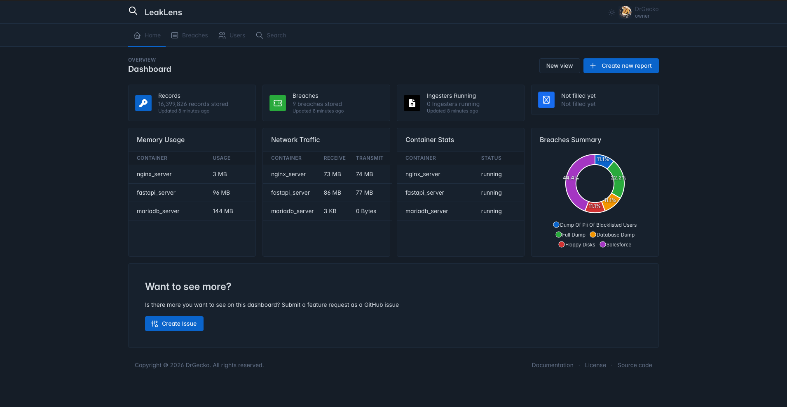

# LeakLens

LeakLens is a self-hosted data analysis platform. It lets you ingest, browse and search data through a web interface. It includes RBAC, authentication, container monitoring and a interactive dashboard.

## What it does

- **Stores data** in per-breach MariaDB tables with structured fields for PII, socials, and extra metadata
- **Search across any field** in any breach table using a flexible query interface with keyword searching
- **Dashboard** shows live record counts, breach breakdowns, and container health
- **Server configuration** editable through the UI without having to touch files

## Stack

| Layer | Technology |
|-------|-----------|
| Backend | FastAPI |
| Database | MariaDB |
| Frontend | Tabler |
